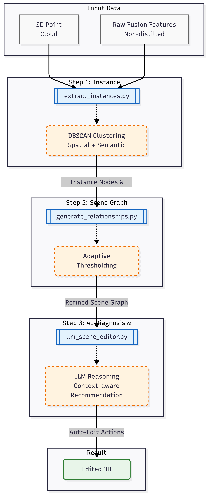

# Context-aware Gaussian Splatting Editor

> **Proactive 3D Scene Editing via Structural Reasoning**

**Context-aware Gaussian Splatting Editor** is a novel pipeline that extends **3D Gaussian Splatting (3DGS)** to enable intelligent, context-aware scene editing.

While **3DGS** has revolutionized 3D reconstruction and synthesis, current editing approaches heavily rely on **manual text prompts** (e.g., *"Remove the chair"*). This creates several limitations:
1.  **Lack of Context:** Edits are performed in isolation without considering the scene's semantic context or spatial layout.
2.  **Prompt Dependency:** The quality of editing depends heavily on the user's ability to craft precise prompts.
3.  **Inefficiency:** Users must manually input commands for every single change, which is tedious for complex scene rearrangements.

**Our Solution:** We propose a **Context-aware Recommendation System**. Instead of waiting for commands, our system constructs a **Scene Graph**, analyzes the spatial context via **LLM**, and **proactively suggests** edits (e.g., *"The chair is blocking the door. Should I move it?"*). The user simply accepts or rejects the suggestion.



---

## 🌟 Key Contributions

### 1. Context-aware Recommendation Engine
Moving away from passive "Instruction-following," we introduce an active **"Scene Diagnosis"** system.
* **Problem:** Manual prompting is slow and requires users to identify all necessary changes themselves.
* **Solution:** We utilize an **LLM (GPT-4)** to reason about the scene based on a **Semantic Scene Graph**. The system identifies clutter, obstacles, or misplacements and generates a list of "Recommended Edits" automatically.

### 2. Geometry-based Instance Segmentation (DBSCAN)
To enable object-level reasoning in static 3DGS scenes without relying on heavy video-based trackers (like DEVA), we implemented a geometry-centric segmentation approach.
* **Method:** We perform **DBSCAN clustering** directly on the **Raw Semantic Features** and spatial coordinates (`xyz`) of the 3D Gaussians.
* **Benefit:** This efficiently separates physically disjoint instances (e.g., distinguishing multiple chairs) purely via post-processing, providing the granular object data required for the Scene Graph.

### 3. Semantic Scene Graph Construction
We structure the unstructured point cloud into a logical graph to facilitate LLM reasoning.
* **Adaptive Thresholding:** We apply dynamic distance thresholds proportional to object scale to robustly capture relationships between large furniture while filtering noise.
* **Rich Context Generation:** The graph is translated into natural language descriptions (e.g., *"A is on B"*, *"C is near D"*), allowing the LLM to understand the physical layout of the room.

---

## 🛠️ Installation

This project requires a standard Python environment with PyTorch and Gaussian Splatting dependencies.

```bash
# 1. Clone the repository
git clone [https://github.com/your-username/Context-aware-Gaussian-Splatting-Editor.git](https://github.com/your-username/Context-aware-Gaussian-Splatting-Editor.git)
cd Context-aware-Gaussian-Splatting-Editor

# 2. Create Conda environment
conda create -n sega python=3.9
conda activate sega

# 3. Install dependencies
# Basic requirements for Gaussian Splatting & Semantic Gaussians
pip install torch torchvision
pip install plyfile shapely openai matplotlib scikit-learn
pip install viser # For visualization
```

## 🚀 Workflow & Usage

The pipeline consists of three main stages: **Instance Extraction**, **Graph Generation**, and **Interactive Editing**.

### Step 1: Instance Segmentation

Perform DBSCAN clustering on the fused point cloud to generate instance masks.

```bash
# Extract instances from 'fusion' results (Raw Features)
python extract_instances.py \
    --input_ply output/room_0/point_cloud/iteration_30000/point_cloud.ply \
    --output_npy instance_ids.npy
```
### Step 2: Scene Graph Generation

Construct a Semantic scene graph using adaptive thresholds
```bash
python generate_relationships_improved.py \
    --input_json scene_graph_nodes_convexhull.json \
    --output_json scene_graph_Semantic.json
```
**Output:** `scene_graph_Semantic.json` (Contains nodes with bounding boxes and filtered relationships) 

### Step 3: Interactive Auto-Editing (Core)

Run the interactive editor. You can choose between **Manual LLM Mode** (Copy-paste prompt to ChatGPT) or **Rule-based Mode**.

```bash
python interactive_editor_free.py \
    --scene_graph scene_graph_Semantic.json \
    --input_ply output/room_0/point_cloud/iteration_30000/point_cloud.ply \
    --instance_ids instance_ids.npy \
    --output_ply scene_edited.ply
```

### Step 4: Visualizationㄴ

Verify the editing results using a Viser-based viewer.
```bash
# Visualize the edited scene
python view_viser.py \
    --config config/view_scannet.yaml \
    model.model_dir=output/room_0 \
    model.load_iteration=30000
```
(Note: Ensure the viewer points to the directory containing your `scene_edited.ply`) 

## 📂 File Structure

| File Name | Description |
| :--- | :--- |
| `extract_instances.py` | Performs **DBSCAN clustering** on raw fusion features to generate `instance_ids.npy`. |
| `generate_relationships.py` | Generates the **Semantic Scene Graph** using adaptive thresholds and priority filtering. |
| `interactive_editor_free.py` | Main engine for **Rich Context Generation** and **Editing (Remove/Move)**. Supports LLM prompts and rule-based logic. |
| `view_instances.py` | Visualizes the 3D point cloud colored by **Instance IDs** to verify the DBSCAN segmentation results. |
| `view_viser.py` | The main renderer for visualizing 3D Gaussian Splatting results. |                                                    |

## 🙏 Acknowledgements

This project is built upon the excellent work of:

* [Semantic Gaussians](https://www.google.com/url?sa=E&source=gmail&q=https://github.com/SegGroup/Semantic-Gaussians&authuser=1) : Provided the foundation for 3D Semantic Segmentation.
* [3D Gaussian Splatting](https://github.com/graphdeco-inria/gaussian-splatting) : The core rendering technology.

## 📝 License

This project follows the license of the original Gaussian Splatting repositories.
